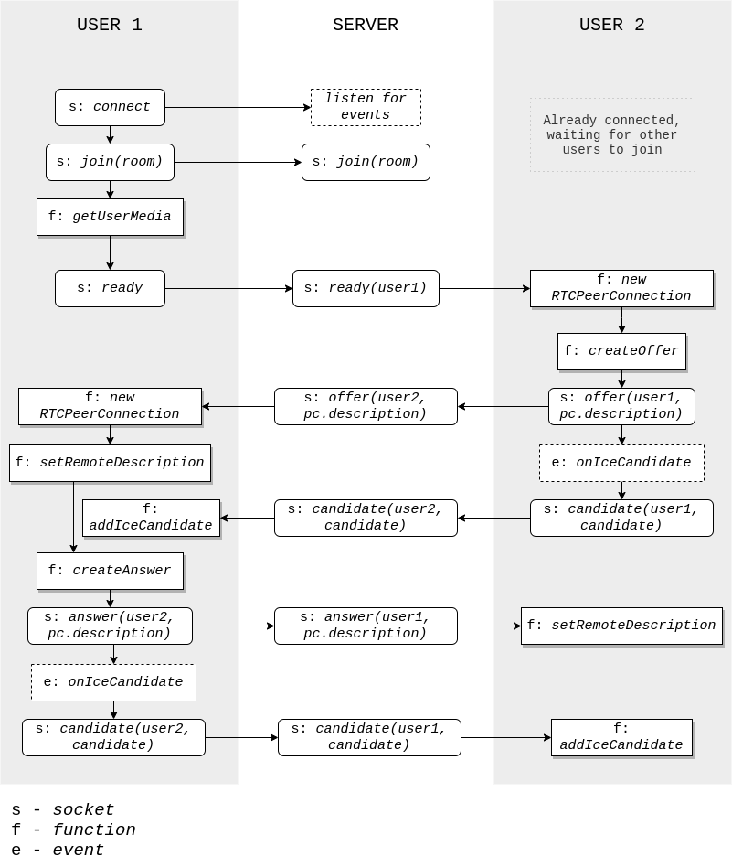

# Video Chat avec WebRTC et Node.js

> Fonctionne sur Ubuntu > 18.04 LTS ou Windows 10.
>
> Lien du code source : https://github.com/EM-Tim/WebRTC.git

## Installation et exécution

1. Installer Git et cloner le dépôt ou télécharger les sources
2. Installer `npm` (> 6.0) et `node` (> 12.0)
3. Se placer dans le répertoire WebRTC (vérifier que le fichier `package.json` est présent)
4. Exécuter `npm install`
5. Exécuter `node server.js` (avec les droits administrateurs)
6. Obtenir son adresse IP, avec la commande `ifconfig` sur Linux ou `ipconfig` sur Windows
7. Se rendre à la page https://localhost sur sa machine ou bien https://mon-ip sur une autre machine du même réseau local (“continuer vers le site” si un message d'avertissement apparaît)
8. Autoriser l’accès au micro et à la webcam

## Fonctionnement

Pour des raisons de séucurité, il est nécessaire d'utiliser le port 443 (HTTPS) pour établir les connexions, avec un certificat et une clé privée. Ces données peuvent être générées à nouveau avec la commande suivante sur Linux : ```openssl req -newkey rsa:2048 -new -nodes -x509 -days 3650 -keyout key.pem -out cert.pem``` mais sont déjà présentes dans le dossier.

L'application Node utilise des sockets (`socket.io`) pour communiquer les informations des clients et `express` pour le serveur web.

### Communications

- Un utilisateur ("User 1") qui se connecte au site depuis un navigateur se connecte au serveur via une socket. 
- Il rejoint un salon de communication. 
- L'accès microphone et caméra est demandé juste après. 
- Après autorisation, le client ("User 1") informe le serveur qu'il est prêt à recevoir des métadonnées. 
- Le serveur se charge de retransmettre sa demande aux utilisateurs ("User 2") du salon. 
- Ces derniers ("User 2") créent une `RTCPeerConnection` avec en paramètres la configuration d'un serveur STUN et TURN.
- Ils ("User 2") créent une offre SDP qu'ils envoie au client faisant la demande ("User 1") via le serveur (socket).
- User 1 reçoit cette offre et créé une `RTCPeerConnection` et créé une réponse SDP renvoyée à User 2 via le serveur (socket).
- Pour finaliser le lien entre les clients, les clients s'envoient leur adresses IP et ports sous forme de `iceCandidate` pour qu'ils se connectent entre eux.
- De cette manière, les clients s'échangent leurs informations permettant la création d'une communication peer-to-peer.
- Chacun reçoit le stream vidéo des autres participants et peut l'afficher.



### Structure des fichiers

- `server.js` : Lance le serveur web
- `RoomService.js` : Gère les messages de signalisation côté serveur
- `video.js` : Gère les messages de signalisation côté client et affiche les données et vidéos sur la page

### Log WebRTC dans le navigateur
- Les statistiques et détails de session sont visibles sur les navigateurs aux liens suivants
  - Firefox `about:webrtc`
  - Google Chrome : `chrome://webrtc-internals`
